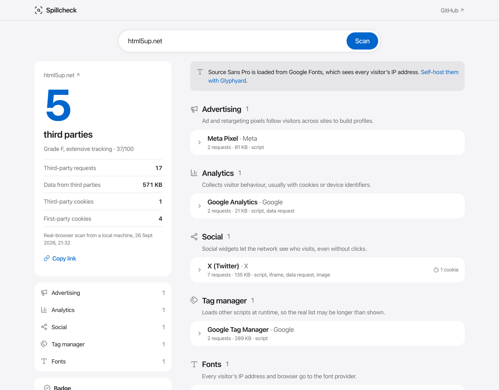

# Spillcheck

**What does your website spill?**

Enter a URL and Spillcheck loads the page in a real browser, records every
request it makes, and names every third party it talks to: fonts, analytics, ad
pixels, session replay, embeds, CDNs. Each one is explained and weighed, and the
page gets a privacy grade from A+ to F.



[](https://vercel.com/new/clone?repository-url=https%3A%2F%2Fgithub.com%2Fobrienafc%2Fspillcheck&project-name=spillcheck)

## Features

- **A real browser.** Pages load in headless Chromium, get scrolled, and are
  watched until the network goes quiet, so trackers added by tag managers and
  scripts are caught, not guessed.
- **Names the parties.** A hand-curated list of 170+ services (Google Analytics,
  Meta Pixel, Hotjar, Google Fonts, jsDelivr and so on) with the company behind
  each. Glyphyard and other Google Fonts proxies are recognised too.
- **Explains why it matters.** Every category says what that kind of third party
  collects.
- **Measures it.** Third-party requests, data transferred, and third-party
  cookies, each attributed to the party that set it.
- **Grades the page.** Ad pixels and session replay cost the most; privacy-friendly
  analytics and fonts cost the least; third-party cookies add a small penalty.
  Domains that share the site's name (bbc.com for bbc.co.uk) are shown as related
  and barely count. Known-malicious domains (like polyfill.io) are flagged.
- **Live progress.** Scans stream their stages and a running request count.
- **Shareable results.** `/?url=example.com` runs the scan on load.
- **JSON API.** `GET /api/scan?url=example.com`, or send
  `Accept: application/x-ndjson` for streamed progress.
- **Badges.** Show a site's grade in a README or footer (see below).
- **Every state in one place.** `/states` renders the empty, invalid, scanning,
  result and error states from saved fixtures, for design review.

## Badges

[](https://spillcheck.patrickob.tech/?url=patrickob.tech)

```markdown
[](https://spillcheck.patrickob.tech/?url=example.com)
```

| Parameter | Default   | Description |
| --------- | --------- | ----------- |
| `url`     | required  | The page to grade. |
| `label`   | `privacy` | Left-hand text, up to 24 characters. |
| `detail`  | off       | `detail=1` adds the count: `B · 2 third parties`. |

Badges read the same cached report as the report page. If a scan fails, the badge shows `unknown` rather
than a broken image. Every result page has copy-ready Markdown and HTML.

## How it works

1. The hostname is resolved first. Private addresses fail immediately.
2. Headless Chromium (`@sparticuz/chromium` on Vercel, your installed Chrome
   locally) opens the page, scrolls it to trigger lazy loading, and waits until
   the network has been quiet for 1.5 seconds (8 seconds at most).
3. Every request is recorded over the DevTools protocol with its type and size;
   cookies are read at the end.
4. Anything outside the page's registrable domain is matched against
   [`lib/parties.ts`](lib/parties.ts) and scored with the weights in
   [`lib/categories.ts`](lib/categories.ts).
5. Reports are cached for six hours in Vercel's runtime cache, shared by the
   report page and badges.

If Chromium can't start, Spillcheck falls back to a static scan of the HTML and
stylesheets and says so in the report.

**Location matters.** Sites often load fewer trackers for visitors in the EU,
where consent laws apply. Reports say where the scan ran. Spillcheck doesn't
click consent banners, so it shows what a visitor gets before choosing.

## Safety

Loading arbitrary pages in a browser on a server is a classic SSRF risk: a page
can ask the browser to fetch internal addresses. So:

- every connection Chromium makes goes through a small forward proxy inside the
  function ([`lib/guard-proxy.ts`](lib/guard-proxy.ts)), including loopback,
  HTTPS and WebSocket traffic;
- the proxy only allows ports 80 and 443 and resolves each destination with a
  lookup that refuses private, loopback, link-local and cloud-metadata
  addresses **at connection time**, which also defeats DNS rebinding;
- the page URL is checked the same way before the browser starts;
- scans are limited in time (20 s to load, 8 s to settle, 60 s in total).

The static fallback uses the same guarded lookup.

## Run it

```bash
npm install
npm run dev
```

Locally, Spillcheck uses your installed Chrome (or `CHROME_PATH`). On Vercel it
uses `@sparticuz/chromium`; `vercel.json` gives the scan and badge functions
2 GB of memory and 60 seconds. Node 20+.

## Contributing

The service list in [`lib/parties.ts`](lib/parties.ts) is the heart of the
project. PRs adding or correcting services are very welcome.

## License

MIT. Sister project: [Glyphyard](https://github.com/obrienafc/glyphyard), which
self-hosts Google Fonts on your own domain.
